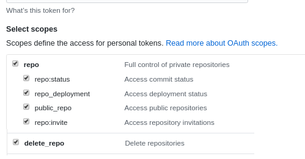

# A simple github cli, very handy!

Author: Robert Nowotniak 2020 <<rnowotniak@gmail.com>>

## Usage

    ghub  -h | help
    ghub [ list ]
    ghub create [ -d <description> ] [ -p ] <repo_name>
                -p  create a public repository (private is the default)
    ghub delete <repo_name> [ <repo_name> ... ]
    ghub info <repo_name> [ <repo_name> ... ]

## Token generation & permissions settings

Generate your personal access token in github
**Settings -> Developer settings -> Personal access tokens
-> Generate new token**.

This is the direct link to your [github personal access tokens](https://github.com/settings/tokens).

Permissions required to manage (create/list/delete) both your private and
public github repositories are "repo" and "delete_repo":

Save the generated token (40 random characters) in **.token** file (the exact
path is defined in ghub / `TOKEN_FILE` variable).
## List repositories

    $ ghub 
    ansiblelab
    dropbox-sync-python
    github-cli
    ParticleSwarmOptimization-vb
    qclib
    qopt
    $ _

## Create repository

    $ ghub create -d 'My cli test repo' Test123
    https://github.com/rnowotniak/Test123
    $ _

Result
(will be instantly reflected in `ghub list` output too):

## Delete repository

    $ ghub delete Test123
    $ _

    $ ghub delete non-existing
    Not Found
    $ _

## Get repository info

    $ ghub info github-cli | jq -r .description
    A simple CLI for github (repository list/create/delete/info)
    $ _

    $ ghub info saltlab | jq -r .license.name
    GNU General Public License v3.0
    $ _

    $ ghub info ansiblelab | jq -r .updated_at
    2020-03-24T03:30:25Z
    $ _
